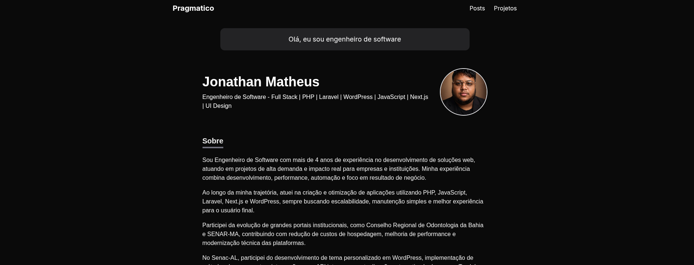

# Pragmatico

Tema escuro e minimalista de portfólio para desenvolvedores e criadores digitais. 
Apresente sua bio, experiências profissionais, projetos e blog em um só lugar, construído com Tailwind CSS.

## Abrir e rodar o projeto

Após concluir a instalação do LAMP, siga estes passos:

1. Faça o download do WordPress a partir deste link: (https://br.wordpress.org/download/).
2. Instale e configure o WordPress conforme as instruções.
3. Vá até a pasta chamada "wp-content/themes".
4. Crie uma nova pasta dentro dela com o nome "alura_intercambios".
5. Coloque todos os arquivos que você baixou deste repositório dentro da pasta "alura_intercambios".
6. Agora, ative o tema que você acabou de adicionar.
7. Por fim, crie as páginas necessárias de acordo com as orientações.

## Como contribuir

1. Faça um fork do projeto: https://github.com/jonathan-matheus/pragmatico
2. Clone o seu fork para sua maquina: git clone git@github.com:jonathan-matheus/pragmatico.git
3. Crie uma branch para realizar sua modificação: git checkout -b name_new_feature
4. Adicione suas modificações e faça commit: git commit -m "Descreva sua modificação"
5. Push: git push origin name_new_feature
6. Crie um novo Pull Request
7. Pronto, agora só aguarde a análise
